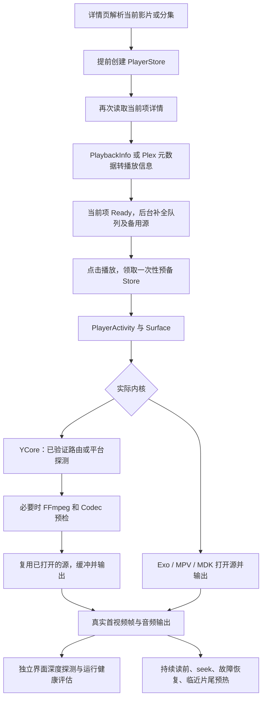

# 播放链路与提速审查 · 2026-09-20

检查对象为当前工作区源码：Git HEAD `1bbf5f12f05e43ef4b6e84ef837766ee92a31bfc`，包含尚未提交的 Android 17 适配。此次只增加审查文档与验证记录，没有修改播放器实现或打包。

结论：优先减少重复元数据请求、为当前影片接入 YCore 实际可消费的预热，并消除界面层重复探测。复杂片源再优化增强解封装的分析预算。继续统一降低缓冲阈值的收益有限，自研内核的起播门槛已经约为 500 ms。

以下“已确认”指源码路径，收益方向是推断，不代表已测得节省多少秒。连接的设备是 Android 9 / API 28，安装的主应用为 1.0.54（216），不对应当前源码；本次未在它上面测算新版本的起播速度，也未覆盖安装。

## 1. 实际链路

未命中详情页预备队列的入口，会在点击后执行 PlayerStore 准备；影片页停留足够久时，这部分等待已提前完成。普通静态文件、HLS/DASH、远程原盘、DRM 的必要准备不同，不应使用同一个激进开播策略。

| 环节 | 当前实现与判断 |
| --- | --- |
| 详情与播放目标 | 普通影片或已知分集可直接确定目标；首次 Series 解析与切换片源仍可能需要目录查询。 |
| 播放协商 | Emby/Jellyfin 必须保留源版本核对、鉴权和会话；Plex 在适配器中将元数据转换成播放信息。 |
| 当前项 Ready | 不等待完整剧集和备用服务器，队列补齐保持当前源与会话。 |
| 实际内核 | Auto 默认开启 Core2 trial；界面偏好的 Exo 名称不一定代表实际由 Exo 解码，应看运行诊断。 |
| YCore 探测 | 可复用同会话结果、已打开的 extractor/增强 demux，以及此前真实播放验证过的路由记录。 |
| 网络 | API 与 YCore 的 OkHttp 路径已共享连接池；重定向/Range 路由状态也已有进程内复用。 |
| 缓存与读前 | 冷读支持 128 KiB 小片段；普通播放异步落盘；Range 续传校验强 ETag，避免拼接不同文件。 |
| 解码与输出 | Codec 预检已有 2 秒上限和单工作通道；真实视频/音频输出有独立证据。增强字幕结果由解复用线程交付。 |
| seek 与切集 | 已有 seek 合并、压缩数据缓存和准备资源的一次性交接；当前项续播与全新会话不能混用。 |
| 下一集 | 实际调度先在距边界 90 秒内预热字节，约 20 秒内准备可移交的源；考虑缓冲、网络、温度与取消。 |

## 2. 建议优先级

### A. 当前媒体详情重复读取：先做，风险较低

已确认：详情页已有 `playTarget`，却只把 itemId 等标识传给 `PlayerStoreFactory`；Store 在协商前再次执行 `repo.itemDetail`。Emby 这次仍请求 People、Overview、Genres 等完整字段；`includeInheritedPeople=false` 只去掉额外继承演员查询，没有精简本次字段。Plex 更明显：`itemDetail` 和紧随其后的 `playbackInfo` 分别读取同一个 metadata 接口。

证据：[DetailComponent.kt:338](D:/Demo/Yfuse/composeApp/src/commonMain/kotlin/com/yfuse/feature/detail/DetailComponent.kt:338)、[PlayerStore.kt:830](D:/Demo/Yfuse/composeApp/src/commonMain/kotlin/com/yfuse/feature/player/PlayerStore.kt:830)、[EmbyDetailService.kt:278](D:/Demo/Yfuse/composeApp/src/commonMain/kotlin/com/yfuse/core/data/EmbyDetailService.kt:278)、[PlexMediaServerAdapter.kt:579](D:/Demo/Yfuse/composeApp/src/commonMain/kotlin/com/yfuse/core/data/PlexMediaServerAdapter.kt:579)。

建议：传入有时效的当前项快照；对并发相同请求合并，必要刷新使用播放专用字段；Plex 同一次准备共用原始元数据，再生成本次的新会话 URL。键必须包含服务器、用户、媒体和版本，换账号/换源/刷新后失效。保留 PlaybackInfo 与物理源一致性检查，不跨播放次数复用旧 PlaySessionId。

收益：减少一次或更多串行元数据往返；点击后才开始准备、快速点播、高延迟服务器收益更明显。详情预备已完成时，主要降低请求量。

### B. 当前影片接入 YCore 预热：点击提速的主要候选

已确认：详情页在 Ready 后调用 `PlaybackSourcePreloader`；Android 实现发现 Core2 将接管播放便直接跳过。因此默认自研模式只提前准备元数据/URL，当前影片字节、索引及容器解析仍主要留到播放时。这个跳过本身是正确的：Media3 缓存不能被 YCore 当成自己的块缓存使用。

证据：[PlaybackPreloader.android.kt:59](D:/Demo/Yfuse/composeApp/src/androidMain/kotlin/com/yfuse/feature/player/PlaybackPreloader.android.kt:59)、[AndroidNextItemPreparation.kt:129](D:/Demo/Yfuse/composeApp/src/androidMain/kotlin/com/yfuse/core2/android/AndroidNextItemPreparation.kt:129)、[AndroidPreparedExtractorSlot.kt:25](D:/Demo/Yfuse/composeApp/src/androidMain/kotlin/com/yfuse/core2/android/AndroidPreparedExtractorSlot.kt:25)。

建议：在当前选择短暂稳定后，按实际内核选择预热器。YCore 沿用下一集的同一块缓存和字节读取设施，先有限预热头部/必要尾部索引，再评估短租期的 extractor 交接。续播不能只下载文件开头，要让支持 seek 的准备路径定位断点附近关键帧；不要按时间比例猜文件偏移。

仅准备当前选定版本；选择变更立即取消、领取后移交、超时释放；受流量和内存预算限制。首帧当前读请求优先于尚未完成的预热。不要在详情页开启有副作用的服务器转码、长期占着 Codec 或把所有版本都下载一遍。

收益：把部分网络和容器准备移到点击之前。只有用户停留足够久、片源可预热且缓存实际命中时，才能换成点击到首帧收益；不是所有冷启动都能“秒开”。Media3 的预加载也遵循提前准备可消费内容的原则，但其 PreloadManager 不能直接管理本项目的 YCore。[Android 官方预加载说明](https://developer.android.com/media/media3/exoplayer/preloading-media/preloadmanager)

### C. 合并界面和内核的探测：优先改善开播后的稳定性

已确认：`PlayerRoot` 无条件调用 `rememberDeepPlaybackProbe`；条件是“不在缓冲或已有错误”，等待 1.5 秒后调用独立服务。该服务会新建 MediaExtractor，必要时再调用 MPV 探测；它没有领取 Core2 的探测结果，也不走 Core2 的私有块数据源。其缓存按完整 URI 与 UA 哈希，新会话 URL 可能再次失配。

证据：[PlayerRoot.kt:783](D:/Demo/Yfuse/composeApp/src/androidMain/kotlin/com/yfuse/feature/player/PlayerRoot.kt:783)、[YCorePlayerRuntime.android.kt:57](D:/Demo/Yfuse/composeApp/src/androidMain/kotlin/com/yfuse/feature/player/YCorePlayerRuntime.android.kt:57)、[PlaybackMediaProbeService.android.kt:43](D:/Demo/Yfuse/composeApp/src/androidMain/kotlin/com/yfuse/core/playback/PlaybackMediaProbeService.android.kt:43)。

建议：内核发布会话内的已知轨道、HDR/DV 与容器事实，界面直接消费；只有缺少会影响路由的事实才补探测。普通后台补探测应等真实输出、足够可播放缓冲及连续健康窗口，错误恢复单独处理。缓存按媒体版本和授权上下文隔离，不能仅删掉签名查询参数后跨用户复用。

这项主要减少重复打开和首帧后的带宽竞争。当前的 1.5 秒是后台探测延迟，不是起播必须等待的时间，不能声称移除它就固定节省 1.5 秒。

### D. 为可保留的 FFmpeg 解封装器设置单独分析档位

已确认：增强探测需要把 demux 保留给正式播放时，传入 `probeOnly = !retainForPlayback`。JNI 只在 `probe_only=true` 时设置限量 probesize/analyzeduration，随后两种路径都会执行 `avformat_find_stream_info`。因此保留源的路径不享受该限量配置，虽然已经避免了再次打开。

证据：[AndroidEnhancedMediaProbe.kt:163](D:/Demo/Yfuse/composeApp/src/androidMain/kotlin/com/yfuse/core2/android/AndroidEnhancedMediaProbe.kt:163)、[AndroidCore2MediaProbe.kt:615](D:/Demo/Yfuse/composeApp/src/androidMain/kotlin/com/yfuse/core2/android/AndroidCore2MediaProbe.kt:615)、[ycore_demux_jni.cpp:1989](D:/Demo/Yfuse/scripts/native/ycore_demux_jni.cpp:1989)。

建议：把“是否保留源”与“分析字节/媒体时长预算”拆成独立参数，完整普通 MKV/MP4 使用较短分析档，缺轨道或特殊 TS/原盘/DV 使用完整档。不能把 `probeOnly=true` 原样用于正式播放：其中的 nobuffer 和探测后样本/seek 状态都需验证。必须回归多音轨、迟到字幕、HDR/DV、音频首包以及已准备源的移交，并验证重建后的 native 制品。

这属于可能影响秒级等待的候选，需测量。FFmpeg 的 analyzeduration 描述分析的媒体时长，不是固定的墙钟等待；数值更大可能增加信息完整性和延迟。[FFmpeg 官方格式选项](https://ffmpeg.org/ffmpeg-formats.html#Format-Options)

### E. 兼容内核 HTTP 连接复用

已确认：API 和 YCore 已共用 OkHttp 连接池，但 Exo、Media3 字节预热及兼容 HTTP 代理仍使用 `DefaultHttpDataSource`，未接入这套池。

证据：[HttpClientFactory.android.kt:28](D:/Demo/Yfuse/composeApp/src/androidMain/kotlin/com/yfuse/core/network/HttpClientFactory.android.kt:28)、[ExoVideoEngine.kt:173](D:/Demo/Yfuse/composeApp/src/androidMain/kotlin/com/yfuse/feature/player/ExoVideoEngine.kt:173)、[PlaybackPreloader.android.kt:98](D:/Demo/Yfuse/composeApp/src/androidMain/kotlin/com/yfuse/feature/player/PlaybackPreloader.android.kt:98)。

建议：兼容路径评估统一的 OkHttpDataSource 与共享客户端/连接池，保留 Range、鉴权、UA、跨域重定向和本地文件支持。CDN 最终地址与 API 不同源时，不能保证省去其握手；MPV/MDK 自身的 native 网络请求也不会因为替换 Exo 工厂就自动共享。

收益主要是兼容内核冷启动和多分片播放，默认 YCore 的既有连接池不应重复改造。统一客户端以共享资源也符合 Android 官方建议。[Android 网络栈说明](https://developer.android.com/media/media3/exoplayer/network-stacks)

### F. 请求优先级与分阶段超时：优化慢场景，需实验

已确认：剧集资料和完整 episode list 在 PlaybackInfo 前就启动异步请求；备用源在 Ready 后立即解析。它们不再阻塞 Ready，但仍消耗服务器和网络资源。YCore 未测出吞吐时预取并发为 3，特定低缓冲高吞吐状态可达 6。单个平台探测则可使用共享 30 秒预算的全部剩余时间，留给后续增强路径的时间没有独立保证。

证据：[PlayerStore.kt:1111](D:/Demo/Yfuse/composeApp/src/commonMain/kotlin/com/yfuse/feature/player/PlayerStore.kt:1111)、[AndroidTransportMediaDataSource.kt:1529](D:/Demo/Yfuse/composeApp/src/androidMain/kotlin/com/yfuse/core2/android/AndroidTransportMediaDataSource.kt:1529)、[AndroidCore2MediaProbe.kt:186](D:/Demo/Yfuse/composeApp/src/androidMain/kotlin/com/yfuse/core2/android/AndroidCore2MediaProbe.kt:186)、[AndroidProbeBudget.kt:11](D:/Demo/Yfuse/composeApp/src/androidMain/kotlin/com/yfuse/core2/android/AndroidProbeBudget.kt:11)。

建议：给当前播放协商/首字节、当前读前、目录/备用源设置相对优先级；拥塞时延后可选请求，健康时保留并行收益。测量每源并发与有效总吞吐后再调，不能简单把并发开到最大或统一改成 1。总截止时间保留，给平台、增强与 Codec 设置有取消能力的子预算；对实测平台不支持的格式可记住增强路径偏好。预检和解封装失败后的恢复同样要受总预算约束。

收益重点是 p95 慢启动及起播后卡顿；目前仅确认调度结构，没有证据证明所有网络下并发 3 比 1 慢。

## 3. 已有优化，应保留

- 当前项 Ready 与辅助资料分离；预备 Store 一次领取，避免后台重复协商。
- 平台 extractor、增强 demux 的限时一次性交接。
- 已验证路由持久化：最多 64 条、30 天、绑定系统镜像；DV Profile 7 不直接复用缺失码流证据的记录。[AndroidYCoreVerifiedRouteMemory.kt:26](D:/Demo/Yfuse/composeApp/src/androidMain/kotlin/com/yfuse/core2/android/AndroidYCoreVerifiedRouteMemory.kt:26)
- 源路由/重定向复用、异步缓存写、强校验续传、冷读小片段与内存预算。
- 自研起播约 500 ms 的缓冲门槛；Exo 均衡普通门槛 1500 ms，有真实缓存/吞吐证据时可降至 500/750 ms。它们都是缓冲门槛，不是点击至首帧承诺。[YBufferController.kt:162](D:/Demo/Yfuse/composeApp/src/commonMain/kotlin/com/yfuse/core2/network/YBufferController.kt:162)、[PlaybackStartupPolicy.kt:17](D:/Demo/Yfuse/composeApp/src/commonMain/kotlin/com/yfuse/core/playback/PlaybackStartupPolicy.kt:17)
- MPV/MDK 已按优化模式和内存设置缓冲；GPU 滤镜、软件解码、复杂字幕更适合用掉帧和 CPU/GPU 指标评估，不应把网络等待都归咎于界面或玻璃效果。
- 下一集已有接近播放边界的预热。[AndroidAdaptiveCore2YPlayer.kt:645](D:/Demo/Yfuse/composeApp/src/androidMain/kotlin/com/yfuse/core2/android/AndroidAdaptiveCore2YPlayer.kt:645)

## 4. 实施与验收

第一批：统一端到端计时，A 元数据复用、C 探测事实复用。第二批：B 当前影片预热、E 兼容 HTTP 栈。第三批：D FFmpeg 分档和 F 弱网调度/子预算。每批分别对比，避免一次改太多无法判断收益。

现有日志已包括 Store 准备、YCore 分阶段耗时、engineElapsedMs 和 activityElapsedMs；仍需从按钮点击带一个单调时间戳和 attemptId 贯穿详情目标解析、Store 领取、Activity、首帧，区分预热开始与用户点击。当前首输出记录的布尔值按 engine 重置，切集/seek 应按输出 generation 另记恢复时刻。[PlayerRoot.kt:500](D:/Demo/Yfuse/composeApp/src/androidMain/kotlin/com/yfuse/feature/player/PlayerRoot.kt:500)

测量点击到真实首视频帧、首次音频输出、seek 到新帧、首 30 秒卡顿、总重缓冲时间、重复源打开数、网络字节、缓存命中与峰值内存。播放时钟开始变化或“Ready”不能替代真实输出。

矩阵：详情立即点/停留后点、冷/热缓存、从头/断点续播、下一集；H.264 MP4、HEVC MKV、HDR/DV、多音轨字幕、HLS/转码和原盘；局域网、跨网高 RTT、带宽骤降；中端设备和 Android 17 设备。每组至少重复 20 次报告 p50；p95 需更多样本并保留原始分布，不能用单次成功代替性能结论。长期吞吐低于码率乘播放倍速时，应选择较低码率版本或经过用户设置允许的转码，增加缓存无法永久解决。

本次验证：18 个针对性测试套件、111 项测试，失败/错误/跳过均为 0；覆盖队列解耦、准备源领取、预热策略、探测预算、路由记录、冷读与 Range 续传、缓存、起播阈值。只验证现有行为，不证明上述建议已经实施或提速。记录见 [verification.json](D:/Demo/Yfuse/audit/playback-chain-20260920/verification.json)。
